# DevOps 03 DevOpsDemo

## Lernjournal Frontend 

| Schritt | Beschreibung | Screenshot |
|--------|--------------|------------|
| 1 | Repository wurde über Visual Studio Code geklont. | 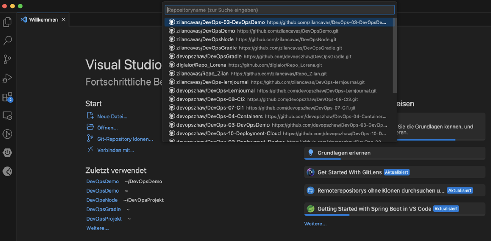 |
| 2 | In den `frontend`-Ordner gewechselt und überprüft, ob `package.json` vorhanden ist. Danach wurden die NPM-Dependencies mit `npm install` installiert. | 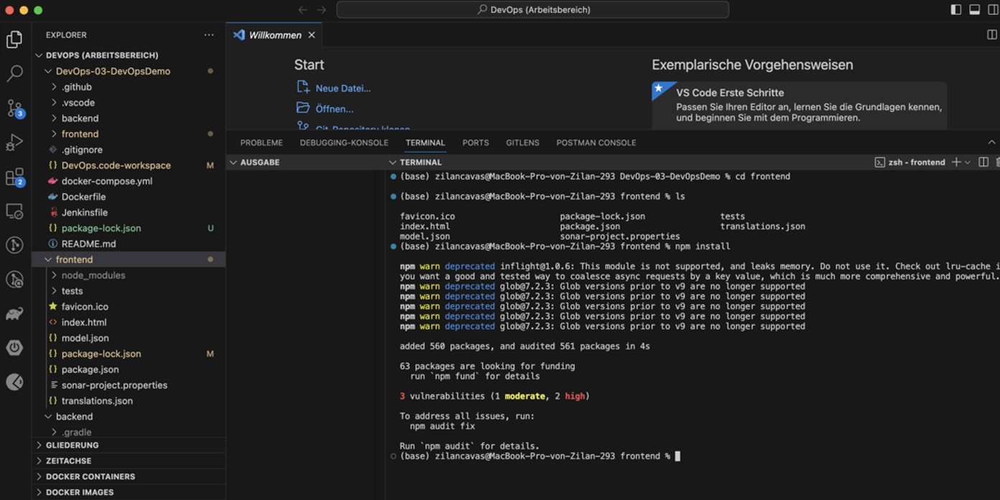 |
| 3 | Das Frontend wurde mit `npm start` erfolgreich gestartet und ist unter `localhost:3000` erreichbar. | 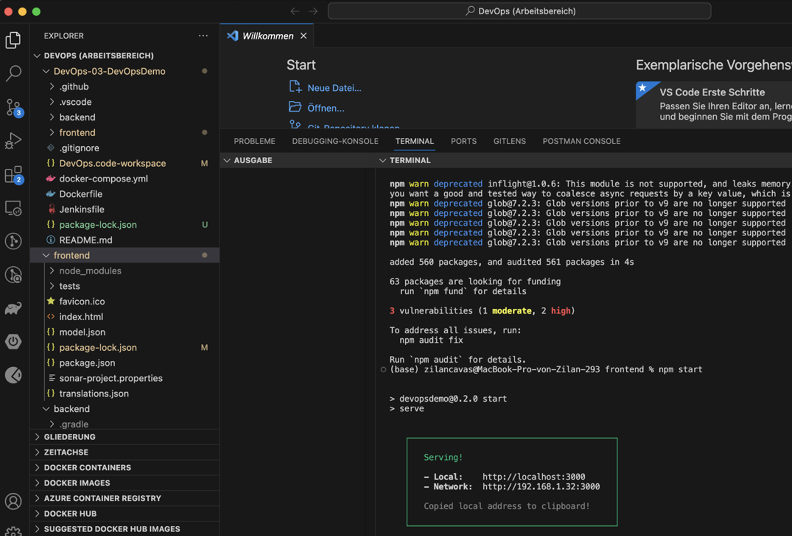 |
| 4 | Das Backend wurde mit `./gradlew bootRun` gestartet. Der Spring Boot-Server läuft unter Port 8080. | 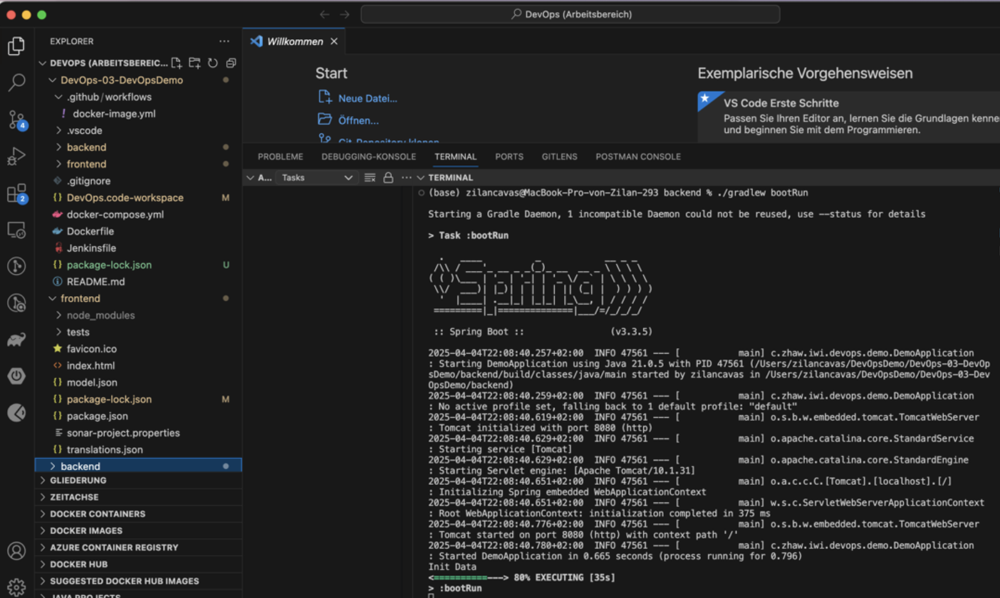 |
| 5 | Das Projekt ist im Browser sichtbar. Die Startseite zeigt den Einstieg in die To-Do-Liste. | 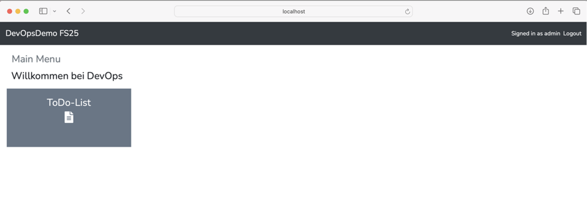 |
| 6 | Vorhandenes Frontend wurde erneut gestartet und getestet. Browserport wurde automatisch angepasst (Port 3000 war bereits belegt). | 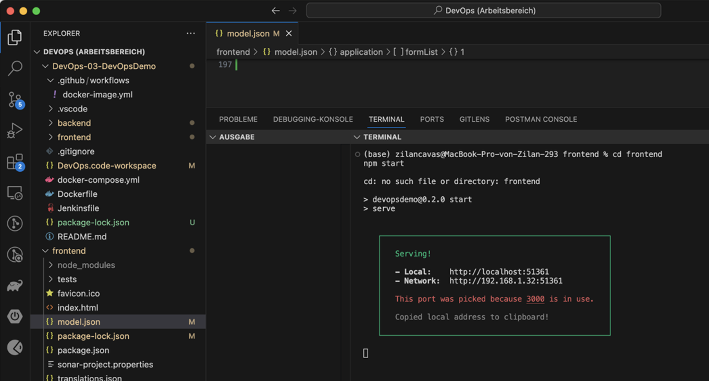 |
| 7 | Die To-Do-Seite wurde geöffnet und bestehende Kacheln angezeigt. Beispielhafte Einträge wie „Unit Tests“, „Deployment“ und „Organigramm“ sind sichtbar. | 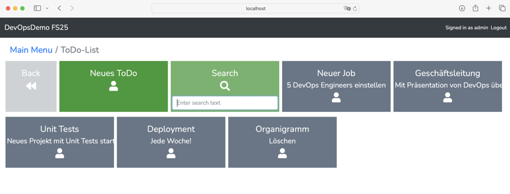 |
| 8 | Eine zusätzliche Kachel „Zilan Test“ wurde im Hauptmenü hinzugefügt, um die Frontenderweiterung zu demonstrieren. | 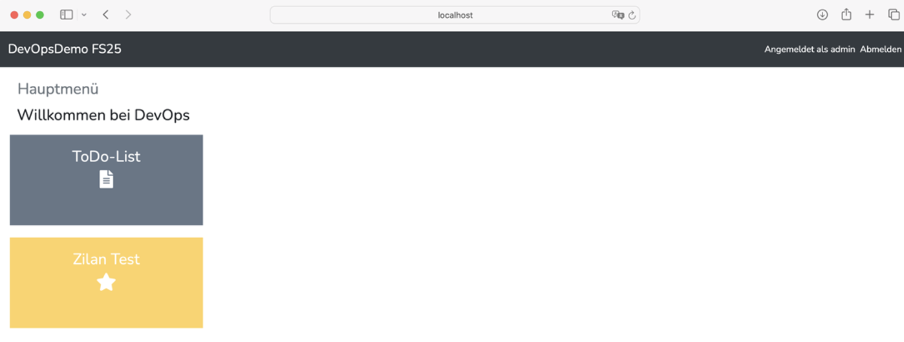 |
| 9 | Alle Änderungen wurden committed und erfolgreich ins GitHub-Repository gepusht. | 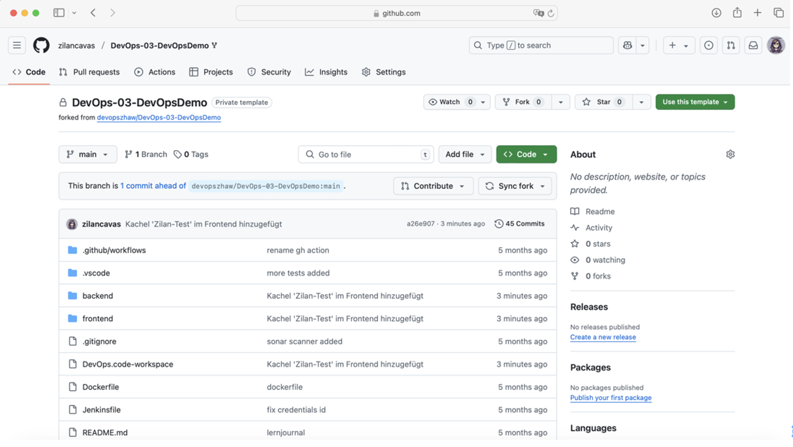 |
| 10 | Die neue Entity-Klasse `ZilanItem` wurde im Backend erstellt, mit Feldern für Name, Beschreibung und Zeitangaben. | 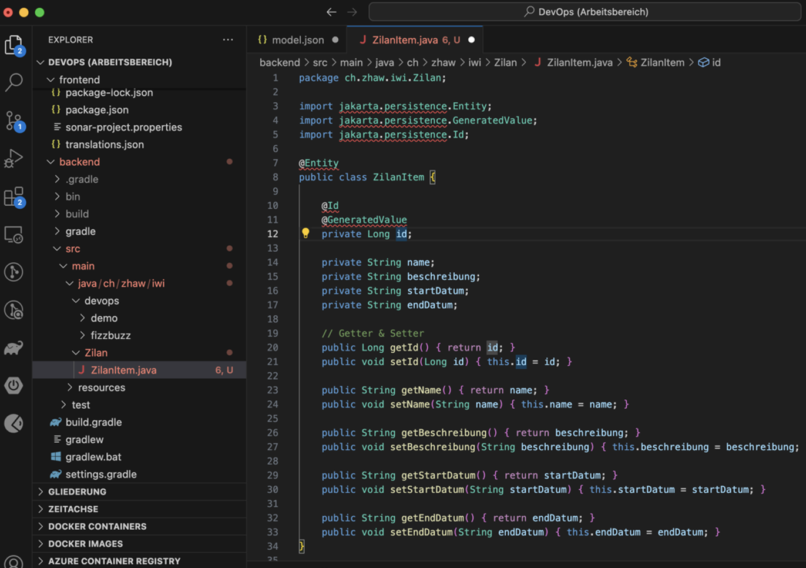 |
| 11 | Das zugehörige Repository-Interface `ZilanItemRepository` wurde erstellt, um CRUD-Zugriffe auf die Datenbank zu ermöglichen. | 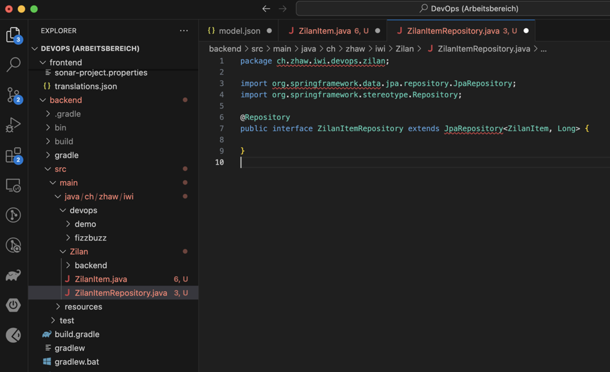 |
| 12 | Ein neuer REST-Controller `ZilanItemController` wurde implementiert, der GET-, POST- und PUT-Endpunkte zur Verwaltung von `ZilanItem` bereitstellt. | 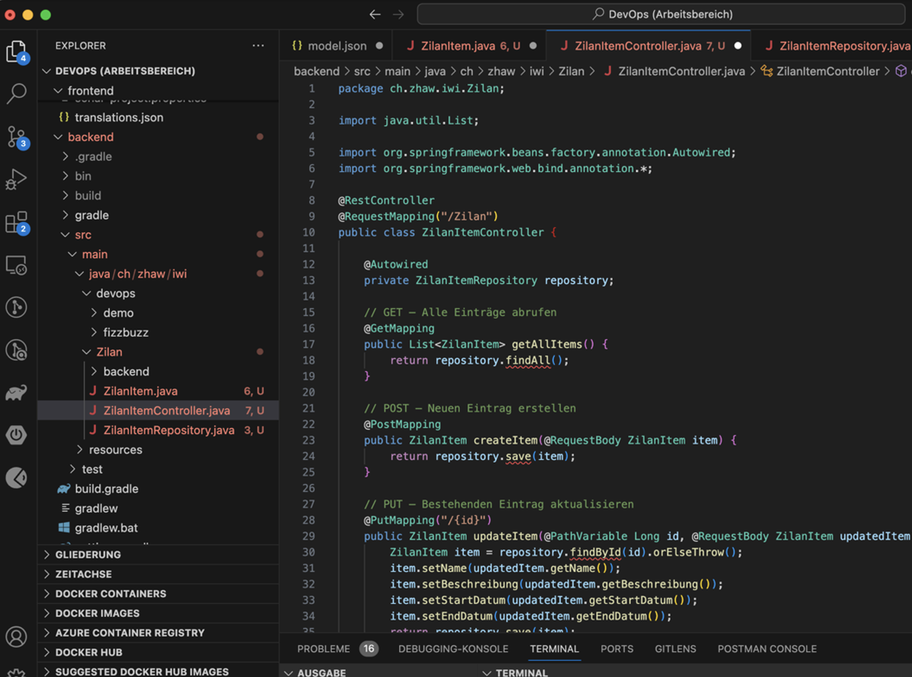 |
| 13 | Der REST-Service wurde erfolgreich getestet: Backend läuft, Endpunkte sind über `localhost:8080/Zilan` erreichbar. | 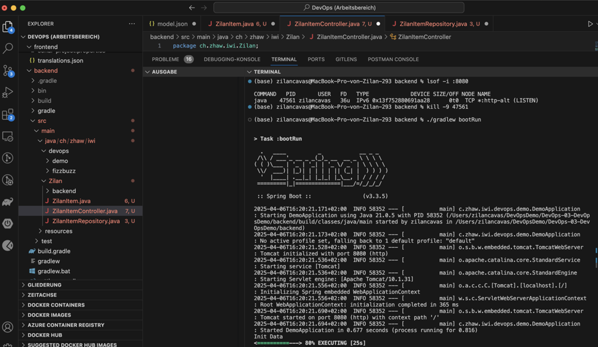 |

## Lernjournal Backend 
| Schritt | Beschreibung                                                                                              | Screenshot              |
|--------|-----------------------------------------------------------------------------------------------------------|--------------------------|
| 1       | Im `backend`-Projekt wurde die Konfiguration der `application.properties` angepasst. Die H2-In-Memory-Datenbank wurde aktiviert und grundlegende Datenbankverbindungsdaten gesetzt. | 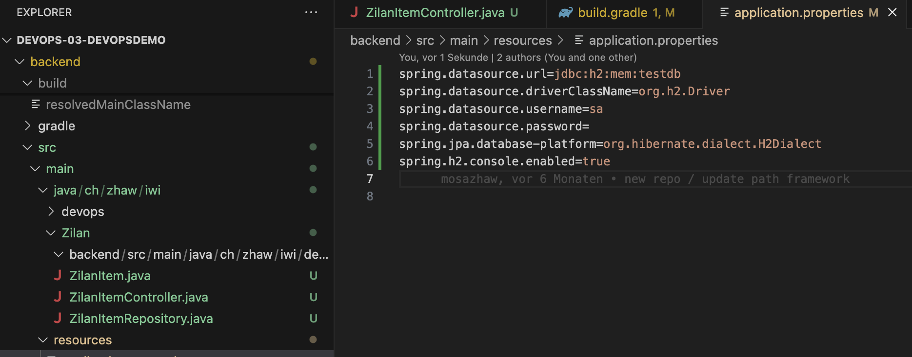 |

